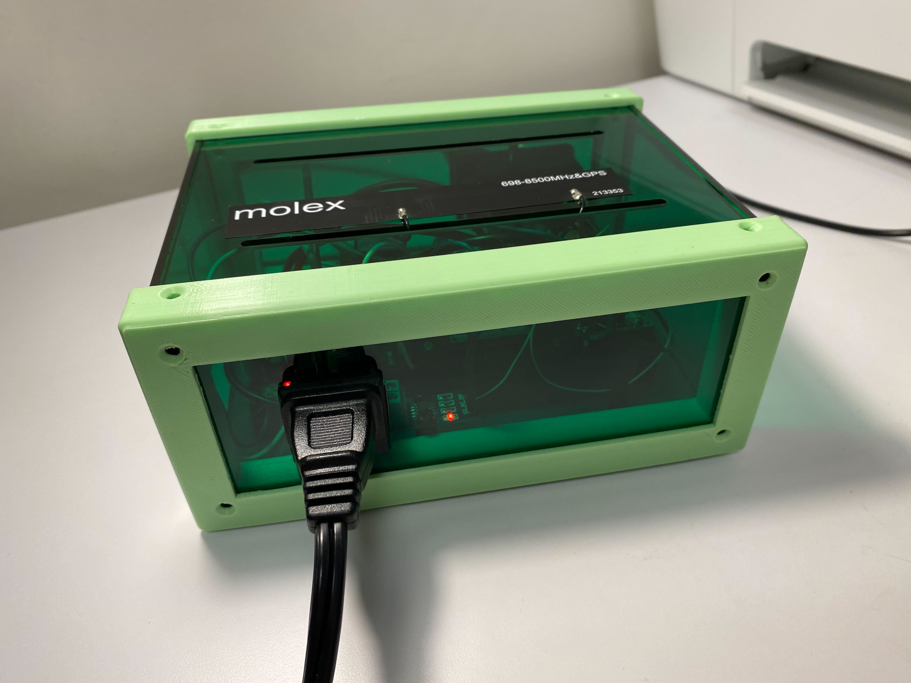
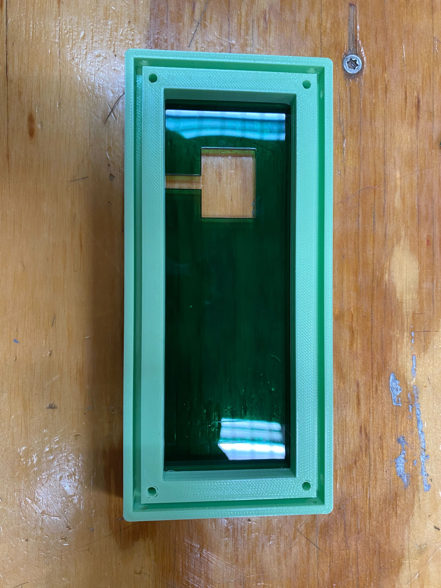
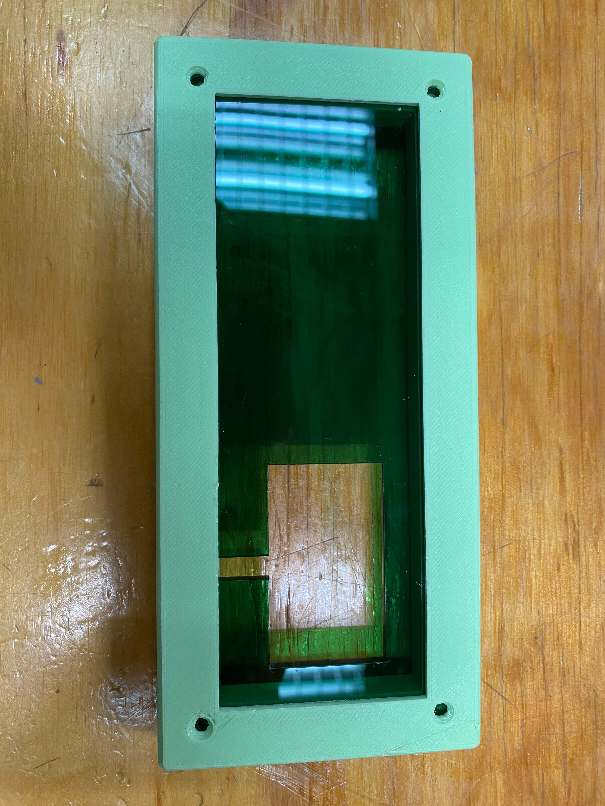
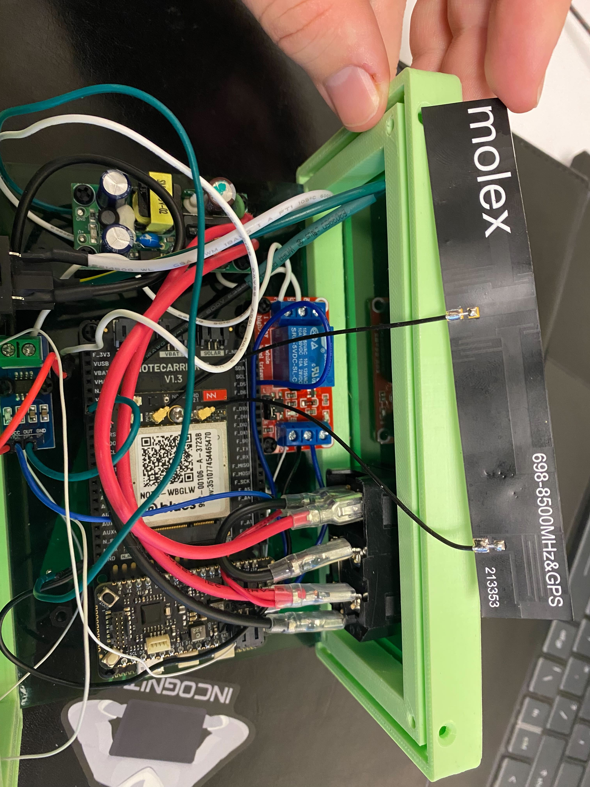
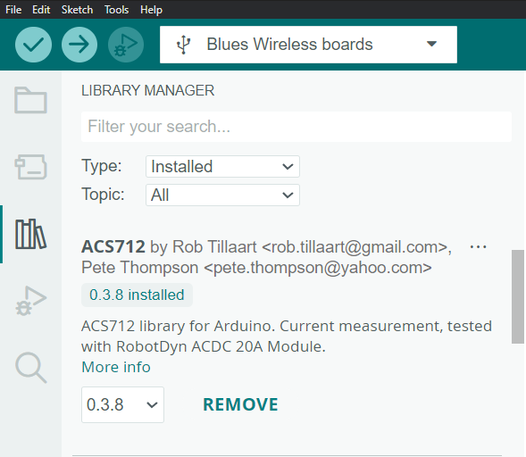
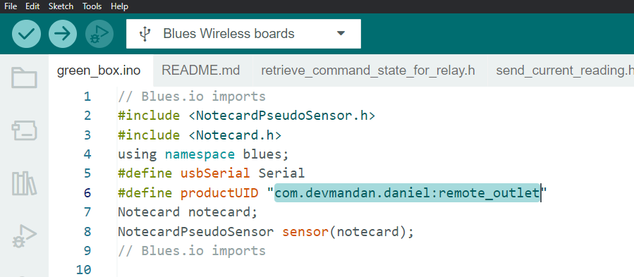

# Green Box: Remotely Controlled Outlet(s) to Reduce Electricity Consumption and Monitor Equipment

# Intro
In a world where customers and investors increasingly support environmentally friendly products and services, distinguishing a genuine eco-conscious company from greenwashers is challenging. Many organizations strive to be recognized for their minimal environmental impact, with some genuinely caring for the environment. The greenbox concept caters to these environmentally conscious companies. It's crucial to acknowledge that people often forget to turn off devices, leading to unnecessary energy consumption. Most companies depend on well-trained employees to remember to switch off equipment, a method that lacks sustainability and transparency.  '
  
Personally, I often joke that I'm a one-man ecological disaster due to my environmentally harmful habits, such as not recycling and using disposable plates and cups excessively. Despite this, I consider myself environmentally aware. My individual environmental footprint may be small, but my professional decisions can significantly impact the environment. To compensate for my subpar personal environmental practices, I propose an idea to help companies reduce power consumption. This involves remotely monitoring and deactivating outlets that consume power unnecessarily, a step towards more responsible energy use in the workplace.

# Materials and Supplies
- [Blues Global Starter Kit](https://shop.blues.com/products/blues-global-starter-kit)
- [One Channel 5V Relay](https://www.amazon.com/gp/product/B00LW15A4W/ref=ox_sc_saved_title_2?smid=A30QSGOJR8LMXA&psc=1)
- [Wired Outlet Plug](https://www.amazon.com/gp/product/B092VQNKN7/ref=ox_sc_saved_image_3?smid=AOTJB6UAIIPDH&psc=1)
- [Fused Power Socket with Rocker Switch](https://www.amazon.com/gp/product/B07Y8DBF7T/ref=ox_sc_saved_title_6?smid=A1ZS0R4YE7AG81&psc=1)
- [AC to DC 5V Power Supply](https://www.amazon.com/gp/product/B07V5XP92F/ref=ppx_yo_dt_b_search_asin_title?ie=UTF8&psc=1)
- [Power Cord](https://www.amazon.com/gp/product/B000067SLV/ref=ox_sc_saved_title_4?smid=ATVPDKIKX0DER&psc=1)
- [ACS712 Current Sensor](https://www.amazon.com/gp/product/B00XT0PL20/ref=ox_sc_saved_title_7?smid=A30Y6WWS77DGEW&th=1)
- [1/8 inch (3mm) Acrylic 5 Sheets](https://www.amazon.com/gp/product/B0BN17KVV5/ref=ppx_yo_dt_b_search_asin_title?ie=UTF8&th=1)
- 3D Printing Filament PLA
- [wires](https://www.amazon.com/gp/product/B089CXJPSC/ref=ppx_yo_dt_b_search_asin_title?ie=UTF8&th=1), [wires](https://www.amazon.com/gp/product/B089D13Y1N/ref=ppx_yo_dt_b_search_asin_title?ie=UTF8&th=1), [wires](https://www.amazon.com/gp/product/B083352WFF/ref=ppx_yo_dt_b_search_asin_title?ie=UTF8&psc=1), and more [wires](https://www.amazon.com/gp/product/B07GD2BWPY/ref=ppx_yo_dt_b_search_asin_title?ie=UTF8&th=1)
- [Soldering Flux](https://www.amazon.com/gp/product/B008ZIV85A/ref=ppx_yo_dt_b_search_asin_title?ie=UTF8&th=1)
- [M3 Nylon Fasteners](https://www.amazon.com/gp/product/B076J5RGKS/ref=ppx_yo_dt_b_search_asin_title?ie=UTF8&th=1), [M3 Nylon Standoffs](https://www.amazon.com/gp/product/B0B2MPSH6T/ref=ppx_yo_dt_b_search_asin_title?ie=UTF8&th=1), and more [M3 Nylon Fasteners](https://www.amazon.com/gp/product/B071XPTK7Z/ref=ppx_yo_dt_b_search_asin_title?ie=UTF8&psc=1) because Nylon doesn't conduct electricity well at all.
- [Super Glue](https://cad.onshape.com/documents/e05155efe7ebecf075a4ab0f/w/05d481c3344dacce6687c214/e/0d07fca45d25f3ce5d8b2458)
- [USB-A to Micro USB type B](https://www.amazon.com/Amazon-Basics-Charging-Transfer-Gold-Plated/dp/B0711PVX6Z/ref=sr_1_1_ffob_sspa?crid=2TSE39WH3Y3PM&keywords=usb+b+micro&qid=1704455449&s=electronics&sprefix=usb+b+micro%2Celectronics%2C89&sr=1-1-spons&sp_csd=d2lkZ2V0TmFtZT1zcF9hdGY&psc=1) to flash board
- [Cotton balls](https://www.amazon.com/Amazon-Basics-Cotton-Balls-200ct/dp/B09497R2CN/ref=sr_1_1_f3_0o_fs_mod_primary_alm?crid=2W1GEA4SM3F57&keywords=cotton+balls&qid=1704460676&sbo=m6DjfpMzMLDmL8pSMKX8hw%3D%3D&sprefix=cotton+balls%2Caps%2C104&sr=8-1) for cleaning burn marks on cut panels
- [Cotton Swabs](https://www.amazon.com/Amazon-Basics-Cotton-Swabs-500ct/dp/B09541P9WH/ref=sr_1_1?crid=2P40P7O7ASRQJ&keywords=cotton+swabs&qid=1704460713&sprefix=cotton+swab%2Caps%2C99&sr=8-1) for cleaning burn marks on cut panels
- [Rubbing Alcohol](https://www.amazon.com/Amazon-Basics-Cotton-Swabs-500ct/dp/B09541P9WH/ref=sr_1_1?crid=2P40P7O7ASRQJ&keywords=cotton+swabs&qid=1704460713&sprefix=cotton+swab%2Caps%2C99&sr=8-1) for cleaning tooling marks
# Tools
- [Helping Hands](https://www.amazon.com/gp/product/B08R5CDSX4/ref=ppx_yo_dt_b_search_asin_title?ie=UTF8&psc=1) for holding wires and parts while soldering
- [Wire Strippers](https://www.amazon.com/gp/product/B000JNNWQ2/ref=ppx_yo_dt_b_search_asin_title?ie=UTF8&th=1)
- [Wire Wrap Tool](https://www.amazon.com/gp/product/B00C9NWR1Q/ref=ppx_yo_dt_b_search_asin_title?ie=UTF8&psc=1) for a quick way to alternatively attach wires
- [Portable Soldering Iron](https://www.amazon.com/gp/product/B071K5FNGT/ref=ppx_yo_dt_b_search_asin_title?ie=UTF8&th=1)
- [Dremel 3D40 Printer](https://fox.build/equipment/dremel-3d40-printer/)
- [Laser Cutter](https://fox.build/equipment/big-blue-laser/)
- [X-ACTO Knife](https://www.amazon.com/X-ACTO-Yourself-Great-Arts-Crafts/dp/B000HGMA7I/ref=sr_1_18?crid=2ZWGVE0B9VYF9&keywords=xacto+knife&qid=1704454816&s=arts-crafts&sprefix=xacto+knif%2Carts-crafts%2C81&sr=1-18) and/or [Clay Shaping Tools](https://www.amazon.com/TEACHERS-Pottery-Sculpting-Double-Sided-Handles/dp/B08KD22B4Y/ref=sxin_14_pa_sp_search_thematic_sspa?content-id=amzn1.sym.d17ca69f-1a39-4f7d-a62f-e5dff4cfd6d8%3Aamzn1.sym.d17ca69f-1a39-4f7d-a62f-e5dff4cfd6d8&crid=3MHP9RQ7BRLKI&cv_ct_cx=clay%2Btools&keywords=clay%2Btools&pd_rd_i=B08KD22B4Y&pd_rd_r=433f3911-ace5-4a88-bd69-c692e95231da&pd_rd_w=L0WzA&pd_rd_wg=To8vL&pf_rd_p=d17ca69f-1a39-4f7d-a62f-e5dff4cfd6d8&pf_rd_r=483JTGC1JKDE6PRFGBTV&qid=1704454738&sbo=RZvfv%2F%2FHxDF%2BO5021pAnSA%3D%3D&sprefix=clay%2Btools%2Caps%2C91&sr=1-2-364cf978-ce2a-480a-9bb0-bdb96faa0f61-spons&sp_csd=d2lkZ2V0TmFtZT1zcF9zZWFyY2hfdGhlbWF0aWM&th=1) for cleaning up 3D print
# Software Tools
- [Arduino](https://www.arduino.cc/en/software)
- [VSCode](https://code.visualstudio.com/)
- [Notehub](https://notehub.io)
- [Python 3.10.0](https://www.python.org/downloads/release/python-3100/)
# Schematic

[KiCAD Zipped Files](./Green_Box_KiCAD.zip)
# CAD

- [3D Printed Edges](https://cad.onshape.com/documents/768bf325ce61f204b1c20e3a/w/13f10a06ca5bd000585b50f8/e/0a809bd2397b4e0a646dd88c) [(STL File)](./CAD/3D%20Printed%20Edge.stl)
- [Bottom Panel](https://cad.onshape.com/documents/b0d329d86337c70760adce23/w/ca1183aaf425e30395dbaaf4/e/549da84961c1aeb2ba495f54) [(DXF File)](./CAD/Green%20Bottom.dxf)
- [Front Panel](https://cad.onshape.com/documents/e55aef7daf51d2362b13b44b/w/da2b1076433f546c797e1f83/e/66cb452b38848d0268798330) [(DXF File)](./CAD/Front%20Panel.dxf)
- [Back Panel](https://cad.onshape.com/documents/593eb36193b087ff43dc2f72/w/bbb9e1fdf7dfe1317e187362/e/3f4225e0dbdc0654de7b20f0) [(DXF File)](./CAD/Back%20Panel.dxf)
- [Side Panel](https://cad.onshape.com/documents/a36065bf40c209600cc4383d/w/08a4eee43424d48ec8693589/e/5a183de64443f7edcd656746) [(DXF File)](./CAD/Side%20Panel.dxf)
- [Top Panel](https://cad.onshape.com/documents/84086fb6dc831c0922238dac/w/1929451043a0cdd72cf4c331/e/d913d1e3925c53207bd2e979) [(DXF File)](./CAD/Top%20Panel.dxf)
- [Foot Pad](https://cad.onshape.com/documents/e05155efe7ebecf075a4ab0f/w/05d481c3344dacce6687c214/e/0d07fca45d25f3ce5d8b2458) [(STL File)](./CAD/Foot%20Pad.stl)
# Guide
### Start with Printing Edges and Cutting Panels
For me, it's really frustrating when hardware moves around and isn't secure. It makes troubleshooting much more difficult if electronics are moving and aren't mounted firmly in place. So we're going to start by 3D printing the edges and laser cutting the panels. So open whatever compatible slicer software you have and prepare your print file for printing. Please know that the image below is representative and isn't ultimately the print file I ended up using.

Here you can find the [3D Print gcode I used](./3D%20Print/Green%20Box%20Enclosure%20Edge.gcode), but results may vary because you may have a different printer than the one I used. However, looking at the supports I used may be very useful. It took quite a lot of trial and error to get the supports right, and you want to avoid any layer shifts to have panel fit easily. You'll want to print 2 of these edges.

Next you want to use the dxf files and load them into your laser cutting software and verify correct units within the software. Then utilize 70% power and 5.5mm/s jogging speed to cut the acrylic panels. Depending on how much wear and the wattage of the laser you use, you may have to use different settings used to cut through the acrylic sheets. Cut out the bottom, 2 sides, top, front, and back panel. Given the tedious nature of 3D printing, it is really nice to be able to laser cut parts for any design changes. This is especially true for prototyping. There is time saved on small changes where you don't have to wait as long for a machine to run to make you a part.

Next you'll notice there are burn marks left over from the laser cutting through.

You'll want to use rubbing alcohol to clean that up.

That's much better!

Also, you'll want to spend time using an X-ACTO knife and other sharp tools, like from a clay sculpting kit to clean off any supports from your 3D prints.

The edge should be able to cleanly fit one of the front of back panels, and use them to gauge how cleaned up the edge parts are for the box.
### Test Fit Panels and Edges
Next you'll want to test fit parts together to make sure they all go together nicely.


Now you will want to make verify that the front plug fits correctly.

You will want to trim the tabs on the fused power socket to make sure they fit and snap into place.

Now you'll want to make sure panels fit together snuggly like the bottom, sides, and top slide easily together and apart.
### Mount Electronics
Now mount the blues wireless board by using M3 standoffs and M3 fasteners together onto the bottom panel.


Mount the relay, ACS712 current sensor, and the AC to DC power supply.

At this point I decided to permanently glue the bottom panel to each edge using super glue, but that is a somewhat irreversible decision. You can also choose to temporarily fasten the bottom panel together. I just kept sliding panels in and out of place by flexing the bottom panel slightly. However, this might not work for everyone because if you use too much force you can crack the bottom panel. So I recommend most people use fasteners.

This clamshell configuration of the case is immensely useful for easily soldering and being able to reach hands into the case from the sides.

### Wire Electronics together
Solder the electronics together according to the schematic, starting with the internal components that are mounted and working your way outward to the plug and socket on the front and back panel.

It would probably be best to download the [KiCAD schematic](./Green_Box_KiCAD.zip) and be able to zoom in and out on the wiring. In hindsight, I'd recommend desoldering the headers on the blues wireless board for a more secure connection. I had to resort to using jumper wires and wirewrapping some of the ends to make some of the connections.
You'll also want to carefully add the antenna once you're certain of the wiring.

At the end, you'll want to pop out the socket in the back panel and plug in the usb cord like below to be able to flash software.

Now we're ready to move onto the software!
### Programming the Green Box with Arduino IDE
Copy or `git clone https://github.com/legut2/Green-Box-Remotely-Controlled-Outlet.git` the code folder into your Arduino folder, and also open the same folder up with VSCode. The path for me at the end is:

`C:\Users\daniel\OneDrive\Documents\Arduino\Green-Box-Remotely-Controlled-Outlet-main`

We'll be using the Arduino IDE and you will want to reference [the following guide](https://dev.blues.io/swan/using-arduino-ide-with-swan/) to setup your Arduino IDE. I mostly did all the same setup but used the 'Blues Wireless Boards' board after importing the board manager file: `https://github.com/stm32duino/BoardManagerFiles/raw/main/package_stmicroelectronics_index.json`


Install the following libraries from the library manager within Arduino: [Blues Wireless Notecard by Blues](https://github.com/blues/note-arduino), [Blues Wireless Notecard Pseudo Sensor by Blues Wireless](https://github.com/blues/notecard-pseudo-sensor), and [ACS712 by Rob Tillaart, and Pete Thompson](https://github.com/RobTillaart/ACS712)




Create a notehub.io account, create a project, and copy the product UID:


Replace the existing `productUID` at the top of `green_box.ino`:



Whenever flashing the board, it's important to keep in mind that you'll have to do the following sequence after hitting upload each time: 

```Press and hold the BOOT button on the Swan, press and release RESET, then release BOOT to cause the Swan to jump into its bootloader. This sequence must be done every time you want to upload firmware to the Swan.```

Now go ahead and flash the board! Now measurements of current are being sent to notehub.io!


You should be able to see data recorded under events within your notehub.io dashboard now. This will allow you send current sensor readings to be recorded.

### VS Code: using a python client to turn the outlet on and off remotely!
Time to send the box commands and remotely control the outlet through a python client that naively sends the desired relay state over and over again.


Make sure to have python 3.10 installed. Now open up VS Code and we'll go ahead and update the .env file with the appropriate credentials so we can send commands through notehub.io. You can find the `.env_example` file within the `send_command` folder. The python script `send_command.py` automatically sources/loads a `.env`. However, you need to change the `.env_example` to be named `.env`. As best practice, it's wise not to commit this file to github or any kind of version control software.

#### Create `CLIENT_ID` and `CLIENT_SECRET` within notehub.io
Navigate to your dashboard and click on settings.  


Now go ahead and scroll down through your and click on `Generate programatic access`, copy the credentials into `.env`, and click save within the settings!


#### Find `PROJECT_ID` and `DEVICE_ID`

Scroll all the way back up and copy over the `Project UID` without the `app:` over to your `.env` file for `PROJECT_ID`. You can also see this as part of the URL within your web browser's address bar.


Lastly, click onto `Devices` and copy over the relevant ID under the `Best ID` column for `DEVICE_ID` within the `.env` file.


#### Run `send_command.py`
Create a virtual environment for your dependencies:  

`python -m venv .venv`  

To activate:
#### windows  
`.\.venv\Scripts\activate`
#### linux/mac
`source .venv/bin/activate`

Install dependencies:  
`pip install -r requirements.txt`

Run the client:
`python send_command.py`

Type `True` or `False` and wait 20-30 seconds and the Green Box should update to that state. You can troubleshoot by looking at the events tab within `notehub.io` and looking at the serial monitor to see if it is looping through the notes. `False` should open the relay, and `True` should make the relay closed.


# Success!

